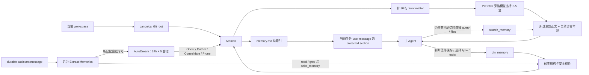

# 腰果记忆系统 04：长期记忆 Memdir v1

状态：已接入唯一 Agent 运行链路
日期：2026-08-09

## 一、目标与决策边界

长期记忆只保存“代码之外、跨会话仍有价值”的高信噪比信息。腰果不设置宿主关键词分类器：主 Agent 与后台 Extract Memories Agent 分别在前台显式保存和后台自动提取场景中负责语义判断，二者复用同一个模型网关与 Agent loop；宿主只执行可确定验证的约束。

| 决策 | 负责方 |
|---|---|
| 当前任务是否需要历史知识 | 大模型 |
| `memory.md` 中哪些主题相关 | Prefetch 旁路模型与主模型 |
| 一条信息是否值得跨会话保存 | 主 Agent 或 Extract Memories Agent |
| `type`、`topic`、摘要与正文 | 大模型 |
| 重复主题、矛盾事实、合并与删除 | AutoDream 模型 |
| 类型是否属于封闭枚举、来源依据是否匹配 | 宿主 |
| 文件名、Front Matter、大小、路径和链接安全 | 宿主 |
| 相对日期、凭据、本地路径等确定性禁区 | 宿主 |

因此，系统建立的是模型可执行的决策协议，而不是在模型之前增加第二套语义路由。

## 二、路径与 Git Worktree

生产默认目录为：

```text
~/.yaoguo/projects/<canonical-root-slug>-<sha256-12>/memory/
```

解析顺序固定为：

1. 将当前 Agent 的 workspace 解析为真实目录。
2. 调用 `git rev-parse --path-format=absolute --git-common-dir`。
3. 当 common directory 是 `<repo>/.git` 时，以 `<repo>` 的真实路径作为 canonical Git root。
4. 非 Git 目录以 workspace 自身的真实路径作为 canonical root。
5. 对 canonical root 做 NFKC 规范化，生成可读 slug，并附加 12 位 SHA-256 摘要防止清理后的路径碰撞。

普通 checkout 与其所有 linked worktree 的 `git-common-dir` 都指向主仓库的 `.git`，因此会得到同一个目录身份并共享同一份 Memdir。模型和工具参数都不能提供另一个 project id 或任意 Memdir 路径；`_buildAgentToolContext()` 在进入循环前把 store 绑定到当前 canonical workspace。

测试可以注入独立 `baseDirectory`，避免写入真实用户 home。

自定义 Agent 在该 canonical 身份之上增加 `agentType` 命名空间与三种宿主作用域：`agent` 表示同一 Agent 类型跨仓库共享，`project` 位于仓库 `.yaoguo/agents/` 并可进入 Git，`local` 按仓库与 Agent 类型隔离且只在本机。内建 `default + local` 保留上述原目录。完整路径、任务配置与快照协议见 [腰果记忆系统 07：Agent 持久记忆与永续日志 v1](./腰果记忆系统-07-Agent持久记忆与永续日志-v1.md)。

## 三、四种封闭类型

`pin_memory` 只接受以下四种类型，并要求模型同时提交与类型匹配的 `basis`。

| type | basis | 允许保存 | 明确边界 |
|---|---|---|---|
| `user` | `user-stated-profile` | 用户本人的角色、目标、技能水平、工作习惯 | 不保存项目事实，不推断敏感画像 |
| `feedback` | `user-evaluated-ai-behavior` | 用户对 AI 行为的纠正或确认 | 必须标明 `positive` 或 `negative` |
| `project` | `user-stated-noncode-context` | 截止日期、设计目标、团队协作约定等代码外上下文 | 相对日期必须先换算成绝对日期 |
| `reference` | `external-system-pointer` | Linear issue、Grafana 面板、Slack 频道等外部事实源入口 | 只保存指针，不复制外部系统正文；不接受本地路径 |

`feedback` 的两个方向具有同等地位：

- `negative` 保存做错了什么以及以后如何修正。
- `positive` 保存用户确认了什么、为什么正确以及哪些做法应继续复用。

如果只积累负向信号，Agent 会逐渐把“避免犯错”误当成“少做决定”；正向反馈为可复用成功策略提供证据。

## 四、明确不存

以下信息不得写入 Memdir：

- 代码模式与实现细节；
- 架构分析；
- 仓库文件路径；
- Git 历史；
- 调试方案；
- 其他可以从当前代码或仓库重新推导的结论；
- 对话转录、临时任务状态、工具原始输出和未经核实的推测；
- 密钥、令牌、密码和其他凭据。

原因不是这些信息不重要，而是代码、Git 和任务状态存储分别是更权威、更新更及时的事实源。把推导结论复制进长期记忆会制造过期副本。模型每次写入都必须提供 `valueBeyondCode`，说明该信息为何不能由代码重新得到，以及为何跨会话仍有价值。

## 五、两层 Markdown 存储

### 第一层：`memory.md`

`memory.md` 是纯索引，不包含标题、正文或隐藏知识。每个非空行固定为：

```markdown
[user-profile.md](./user-profile.md) — 用户偏好先看结论，再按需展开证据。
```

约束：

- 每行一个主题文件链接和一句摘要；
- 摘要不超过 150 字符；
- 最多 200 行；
- 整个文件不超过 25KB；
- Agent 每个初始模型请求都将它作为 protected section 放入当前任务的 `user` message；
- 索引内容不进入 system prompt；旧全局记忆 RAG 与其独立预算已移除。

### 第二层：主题文件

主题文件名固定为 `<type>-<topic>.md`，其中 `topic` 是最长 60 字符的小写 ASCII kebab-case。例如：

```markdown
---
name: "评审反馈"
description: "用户确认先列证据再给建议的评审方式有效。"
type: feedback
created_at: "2026-08-09T10:00:00.000Z"
updated_at: "2026-08-09T10:00:00.000Z"
---

<!-- yaoguo:memory:<digest> -->
## 2026-08-09T10:00:00.000Z
**反馈方向：** 正向确认

先列风险证据再给修改建议，这种方式应继续复用。

**跨会话价值：** 这是用户对 AI 行为的确认，仓库无法提供。
```

Front Matter 至少包含 `name`、`description` 和 `type`，并记录创建与更新时间。单个主题文件上限为 128KB；相同条目通过内容摘要幂等去重，同一 Memdir 的并发写入通过 keyed serial executor 串行化。

长生命周期 Agent 可把同一 Memdir 配置为 `append-only`。此时前台只向 `logs/{date}.md` 追加结构化记录，`memory.md` 与主题在前台只读；运行时日期由动态 `current_date` 解析，夜间 Dream 统一维护主题和索引。稳定 Prompt 不含具体日期文件名。

## 六、上下文与工具流



召回流程：

1. 宿主确保 `memory.md` 存在并重建失配索引，同时异步启动 Prefetch，不等待旁路完成。
2. Prefetch 对每个主题只读取前 30 行 Front Matter，并把当前对话、候选描述、已展示文件过滤和最近工具名交给独立模型判断。
3. 旁路模型保守选择 0-5 篇；宿主只读取合法选择的正文。若首轮装配前完成，正文进入首轮 protected section；若稍后完成，正文进入下一工具续轮的 protected root。
4. 主 Agent仍判断正文是否适用。Prefetch 未提供所需内容时，主 Agent依据常驻索引调用 `search_memory`，提供 query 或精确 files。
5. `search_memory` 只在已绑定的当前 Memdir 中检索，最多返回 12 个主题，并限制单主题及总返回长度。
6. 两条召回路径都标注“今天 / 昨天 / N 天前”；超过 1 天附带“时间快照、引用前验证”的警告。

Prefetch 不使用旧的关键词索引或向量检索。显式 `search_memory(query)` 仍保留为主模型主动工具；它不是旁路筛选器的实现。

前台显式写入流程：

1. 模型判断信息来源、长期价值和权威事实源。
2. 模型调用 `pin_memory`，提交类型、依据、主题、名称、摘要、正文与 `valueBeyondCode`；feedback 另交方向，reference 另交指针。
3. 宿主拒绝开放 scope、类型错配、相对日期、凭据、本地引用、越界路径和超限内容。
4. indexed 模式原子写入主题并重建 `memory.md`；append-only 模式只追加当日日期日志并返回 `pendingIndex=true`。

后台自动写入在 durable assistant 消息完成后非阻塞启动。若主 Agent 本轮已有成功的 `pin_memory` 回执，后台只推进会话游标；否则 fork 最多 5 轮的 Extract Memories Agent。它先并行读取所有目标，再并行发出 `write_memory`，不能使用 shell、MCP、网络、Skill 或再次触发 Agent。完整协议见 [腰果记忆系统 04B：自动写入 Extract Memories v1](./腰果记忆系统-04B-自动写入-Extract-Memories-v1.md)。

确实产生非重复记忆后，Extract Memories 记录当前会话的 AutoDream 信号。indexed 模式使用“24 小时 + 5 个不同会话”；append-only 模式使用“24 小时 + 1 个新记忆会话 + 待整理日志”，并由启动补偿扫描和本地时间 02:00 的夜间入口调用。模型依次执行 Orient、Gather、Consolidate、Prune and Index；旧事实被新事实推翻时直接从主题正文移除。完整锁与整合协议见 [腰果记忆系统 06：离线整合 AutoDream v1](./腰果记忆系统-06-离线整合-AutoDream-v1.md)。

## 七、与双轨注入的关系

Memdir 不改变已落地的双轨边界：

- 人工指令文件仍通过通道 A 作为独立 `user` reminder 注入。
- 稳定的类型、保存和召回规范仍通过 `block://system.agent#memory.behavior` 进入 system prompt section，并按进程缓存。
- `memory.md` 是跨会话知识的动态索引，位于当前任务的 `user` context；它既不是人工规则，也不是 system prompt。
- 主题正文由 Prefetch 旁路模型选择或主 Agent通过 `search_memory` 主动召回；两者都位于动态对话通道。

三者的缓存与 Token 预算互不绑定：用户修改规则不会重算稳定 system section，主题变化也只更新当前 Memdir 的索引与后续任务上下文。

## 八、安全与恢复

Memdir 创建和读写拒绝符号链接目录、符号链接文件与 `nlink != 1` 的文件；所有解析后的路径必须位于基础目录内。主题和索引使用临时文件加原子 rename 写入。indexed 模式的 `ensure()` 根据有效主题 Front Matter 重建索引；append-only 模式的 `ensure()` 只保证只读索引与日志目录存在，不改索引。日期日志使用 `O_APPEND + O_NOFOLLOW`，单日日志上限为 2MB。AutoDream 在计划提交前比较主题、索引和待整理日志摘要，提交失败时恢复已触碰状态；锁 mtime 只在成功后推进。

## 九、旧数据边界

旧 `workspace/memory/` 与项目 `memory/00-*.md` 到 `92-*.md` 已退役。旧全局/项目 RAG、模板初始化和迁移入口均已移除；历史工作流也不再把这些文件作为参考锚。工作区遗留副本只在明确的不可逆授权后离线删除；启动逻辑不会主动删数据，也不再创建、扫描或迁移它们。

Agent Memdir 自身可导出带摘要的 JSON 快照，并以 `merge` 或显式 `replace` 导入另一个已绑定 Agent 命名空间。Extract Memories 只处理新增对话，AutoDream 也只读写 Memdir。

## 十、实现与验收位置

- 路径身份：`src/platform/memory/memdir/memdirPaths.js`
- Agent profile：`src/platform/memory/memdir/agentMemoryProfile.js`
- 日期日志：`src/platform/memory/memdir/memdirJournal.js`
- 格式与限额：`src/platform/memory/memdir/memdirFormat.js`
- 四类型策略：`src/platform/memory/memdir/memdirPolicy.js`
- 存储、前 30 行扫描与精确读取：`src/platform/memory/memdir/memdirStore.js`
- Prefetch 服务：`src/platform/memory/prefetch/memoryPrefetchService.js`
- Prefetch 格式：`src/platform/memory/prefetch/memoryPrefetchFormat.js`
- Extract Memories 服务：`src/platform/memory/extraction/memoryExtractionService.js`
- Extract Memories 工具边界：`src/platform/memory/extraction/memoryExtractionTools.js`
- AutoDream 调度与模型循环：`src/platform/memory/autodream/autoDreamService.js`
- AutoDream 双门控与锁：`src/platform/memory/autodream/autoDreamState.js`
- AutoDream 四阶段工具：`src/platform/memory/autodream/autoDreamTools.js`
- Agent 接线：`src/application/workflows/mixins/agentExecutionActions.js`
- 工具协议：`src/platform/ai/agentTools/pinMemoryTool.js`、`searchMemoryTool.js`
- 系统规范：`workspace/registries/prompts/blocks/system.agent.v1.json#memory.behavior`
- 旁路选择契约：`workspace/registries/prompts/blocks/memory.prefetch.v1.json`
- 后台提取契约：`workspace/registries/prompts/blocks/memory.extract.v1.json`
- 离线整合契约：`workspace/registries/prompts/blocks/memory.autodream.v1.json`
- 回归测试：`tests/memory-store.test.mjs`、`tests/memdir-paths.test.mjs`、`tests/memory-tools.test.mjs`、`tests/memory-prefetch.test.mjs`、`tests/memory-extraction.test.mjs`、`tests/memory-autodream.test.mjs`、`tests/agent-persistent-memory.test.mjs`、`tests/agent-tools-integration.test.mjs`

动态召回的完整时序、去重与模型配置见 [腰果记忆系统 04A：动态召回 Prefetch v1](./腰果记忆系统-04A-动态召回-Prefetch-v1.md)；后台写入见 [腰果记忆系统 04B：自动写入 Extract Memories v1](./腰果记忆系统-04B-自动写入-Extract-Memories-v1.md)；离线整合见 [腰果记忆系统 06：离线整合 AutoDream v1](./腰果记忆系统-06-离线整合-AutoDream-v1.md)。
