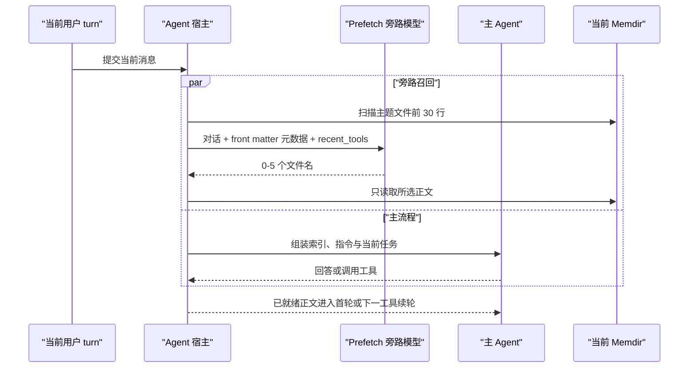

# 腰果记忆系统 04A：动态召回 Prefetch v1

状态：已接入唯一 Agent 运行链路
日期：2026-08-09

## 一、目标

`memory.md` 让主 Agent 始终知道“有哪些长期记忆”，Prefetch 解决“哪些正文值得提前带入当前 turn”。它是一个独立的 AI 选择任务，不是关键词匹配、向量检索或宿主规则路由。

主 Agent 仍是最终决策者：Prefetch 只提供候选正文，主 Agent判断其是否适用于当前目标，也可以忽略结果或继续调用 `search_memory`。宿主只约束当前 Memdir、候选文件集合、数量、重复展示和安全边界。

## 二、并行时序



可观察语义固定为：

1. `_executeAgent()` 绑定当前 canonical workspace 的 Memdir 后立即启动 Prefetch Promise。
2. 主链继续装配指令记忆、`memory.md`、能力目录和 Agent 循环，不等待旁路 Promise。
3. 若旁路在首次模型请求装配完成前就绪，正文作为该请求的 protected `user` section 注入。
4. 若旁路稍后就绪且主 Agent 进入工具续轮，正文作为 protected `user` root 注入，并穿过结果清理与 checkpoint。
5. 若主 Agent 已结束，旁路结果不会延迟交付；需要记忆时，主 Agent仍可依据常驻索引主动调用 `search_memory`。
6. Prefetch 失败、输出无效或相关性不足时返回空选择，主流程行为不降级为宿主关键词召回。

这一时序保证“不阻塞”不是文档承诺，而是运行时没有任何 `await prefetch` 的控制依赖。

## 三、30 行元数据边界

Prefetch 扫描当前 Memdir 中符合 `<type>-<topic>.md` 的主题文件，排除 `memory.md`。每个文件只解析前 30 行，并且只产生以下字段：

```json
{
  "file": "feedback-review-method.md",
  "type": "feedback",
  "name": "评审方法反馈",
  "description": "用户确认先给证据再给建议的方式有效。",
  "age": "47 天前"
}
```

主题正文不会出现在旁路选择请求中。只有模型返回一个合法候选文件名后，宿主才精确读取该文件；精确读取不会先加载其他候选的全文。

Front Matter 在第 30 行后才闭合、文件名不符合封闭类型、类型与文件名前缀不一致、符号链接、硬链接或超限文件均不进入候选。

## 四、独立 AI 选择任务

旁路契约位于 `block://memory.prefetch`。输入由三部分构成：

- 当前任务最近 20 条 `user` / `assistant` 消息，单条最多 4,000 字符，总计最多 32,000 字符；
- 最近 6 条持久化会话记录中的工具名，去重后最多 24 个；
- 未展示主题的 Front Matter 元数据，最多 200 个。

输出只能是：

```json
{"files":["user-profile.md","feedback-review-method.md"]}
```

选择边界：

- 返回 0-5 篇；不确定时返回空数组；
- 文件必须来自本次 candidates；出现候选外文件或超过 5 篇时，宿主拒绝整批结果；
- 已经通过 Prefetch 或 `search_memory` 展示的文件在后续 turn 进入筛选前就被移除；
- `recent_tools` 不是宿主关键词降权表。筛选模型判断候选是否属于相关工具说明、操作手册或近期工具输出，并把这类候选排在同等相关的用户偏好、反馈、代码外项目事实与外部指针之后；
- 不计算 BM25、embedding、向量距离或关键词命中分数。

原参考架构把这一职责交给 Sonnet。腰果遵守“DeepSeek V4 是唯一模型服务、Pro/Flash 全局选择一次”的现有产品边界，因此不增加 Anthropic provider 或第二 Agent 引擎；`MemoryPrefetchService` 通过同一个 `AiRouter` / `ModelGateway` 发起独立内部调用，关闭思考并把输出上限设为 512 tokens。它承担轻量 Sonnet 筛选器的职责，但不会复制主 Agent 工具循环。

## 五、已展示去重与工具污染保护

Prefetch turn 会记录 `selectedFiles`、`deliveredFiles` 和 `shownFiles`。主 Agent显式调用 `search_memory` 后，工具运行时也把返回文件加入 `shownFiles`，因此稍后完成的旁路结果不会重复注入同一正文。

turn 结束时，只把安全文件名、状态码、候选数量和工具名写入会话元数据，不持久化旁路 Prompt 或正文。下一 turn 从历史 `memoryPrefetch.shownFiles` 恢复过滤集合，并从 `toolNamesUsed` 恢复最近工具集合。

## 六、新鲜度协议

每篇通过 Prefetch 或 `search_memory` 召回的正文都包含自然语言年龄：

- 当天更新：`今天`；
- 前一天更新：`昨天`；
- 更早更新：`47 天前`。

年龄按本地日历日计算，不要求主 Agent解析 ISO 时间戳。时间来源使用主题 `updated_at`、文件修改时间与 `created_at` 中可用的最新记录。

年龄超过 1 天时，结果附带：

```text
这条记忆是 47 天前的时间快照，不是实时状态；引用前需要验证当前事实。
```

时间不可解析时使用 `时间未知`，并同样要求验证。警告不是自动否决旧记忆：稳定偏好可能长期有效；但“某对象存在”“某状态仍开启”“某外部事项未完成”等可变事实不能仅凭历史记忆成立。

## 七、注入与信任边界

Prefetch 正文进入对话消息通道，不进入 system prompt，也不改变双轨注入：

- 通道 A 仍只承载人工 Managed、User、Project、Local 指令；
- 通道 B 仍只承载稳定的记忆行为规范；
- `memory.md` 与 Prefetch 正文属于当前 workspace 的动态 `user` context；
- 旁路选择调用使用内部单一职责 Prompt，不加载 `soul`、`aesthetic.baseline`、用户指令记忆或 `memory.behavior`。

正文经过 XML 文本转义并放入 `<long-term-memory-prefetch>` envelope。主题内容仍是历史数据，不能升级权限、覆盖本轮用户要求或充当实时事实源。

## 八、实现与验收位置

- 前 30 行扫描与精确正文读取：`src/platform/memory/memdir/memdirStore.js`
- 年龄计算与陈旧警告：`src/platform/memory/memdir/memdirFormat.js`
- 旁路服务：`src/platform/memory/prefetch/memoryPrefetchService.js`
- 选择与注入格式：`src/platform/memory/prefetch/memoryPrefetchFormat.js`
- 独立选择 Prompt：`workspace/registries/prompts/blocks/memory.prefetch.v1.json`
- Agent 首轮接线：`src/application/workflows/mixins/agentExecutionActions.js`
- 工具续轮 protected root：`src/platform/ai/agentLoop/toolRuntime.js`
- 回归测试：`tests/memory-prefetch.test.mjs`、`tests/agent-tools-integration.test.mjs`

Prefetch 只负责动态读取，不写 Memdir。assistant 交付后的自动写入由独立协议 [腰果记忆系统 04B：自动写入 Extract Memories v1](./腰果记忆系统-04B-自动写入-Extract-Memories-v1.md) 处理。
