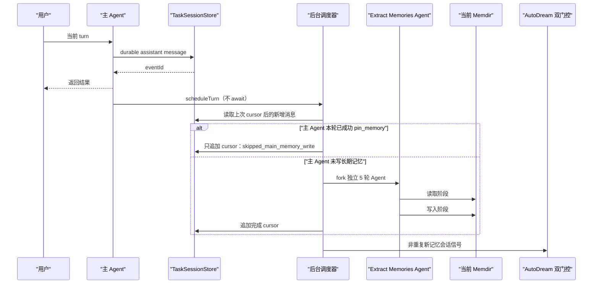

# 腰果记忆系统 04B：自动写入 Extract Memories v1

状态：已接入 assistant 消息持久化后的后台链路
日期：2026-08-09

## 一、目标

长期记忆的语义判断仍由大模型负责，但不要求主 Agent 在每次面向用户的回答中同时完成记忆整理。每轮成功交付后，宿主 fork 一个独立上下文的 Extract Memories 后台 Agent，让它只处理“最近新增对话中是否存在值得跨会话保留的信息”。

这不是第二套执行引擎：主 Agent 与 Extract Memories 复用同一个 `runToolLoop()`、`AiRouter` 和 `ModelGateway`。区别只在触发时机、上下文、轮次预算与工具权限。它不加载 `soul`、`aesthetic.baseline`、用户指令记忆或主 Agent 的完整上下文。

宿主只决定并发、路径、游标、工具边界和封闭类型校验；是否保存、保存哪条、选择哪种类型与主题，全部由 Extract Memories 模型决定。

## 二、非阻塞时序



统一完成钩子位于 `persistAgentTurnOutcome()`：只有 assistant 消息已经稳定写入任务会话、且本轮不是 cancelled 或 blocked，才调度后台任务。`scheduleTurn()` 在同步返回 Job handle 后才通过 Promise microtask 入队，前台路径没有等待 Job 的控制依赖。

同一任务的后台 Job 按 `projectId + taskId` 串行，避免两个相邻 turn 争用同一会话游标。不同任务可并行；共享同一 canonical Memdir 的最终写入仍由 Memdir keyed serial executor 原子化。

## 三、持久化游标

后台提取不把完整会话复制进另一份数据库。每次处理成功、判断无记忆或因主 Agent 已写入而跳过时，只向任务 `events.jsonl` 追加一条：

```json
{
  "type": "memory.extraction.cursor",
  "lastMessageEventId": "assistant:<turnId>",
  "status": "written | empty | skipped_main_memory_write",
  "code": "MEMORIES_WRITTEN | NO_MEMORY | MAIN_MEMORY_WRITE"
}
```

下一 Job 读取同类型最新事件，只向模型提供该游标之后、当前 assistant 消息之前的新增 `user` / `assistant` 消息。窗口仍执行最近 20 条、单条 4,000 字符、总计 32,000 字符的确定性限制。

游标事件使用 turn 作用域摘要生成幂等 `eventId`。相同 turn 被重放时不会再次提取；较旧 Job 发现游标已覆盖更新的 assistant 消息时直接结束，不把游标回退。后台失败时追加 `memory.extraction.failed` 审计事件，但不推进 cursor；下一成功 turn 可重新覆盖尚未处理的对话。Memdir 条目自身带内容摘要去重，因此部分写入后重试不会复制完全相同的条目。

## 四、主 Agent 与后台 Agent 互斥

互斥依据不是用户文本中是否出现“记住”，也不是工具名是否被模型尝试过。主 Agent 循环根据真实工具回执生成：

```text
memoryWritePerformed = 存在 name=pin_memory、ok=true 且 deduplicated=false 的调用
```

该字段随 assistant 消息元数据持久化，并传给后台 Job。值为 `true` 时：

1. 不加载 Extract Memories Prompt；
2. 不调用后台模型；
3. 不读取或写入 Memdir；
4. 只追加 `skipped_main_memory_write` cursor。

`pin_memory` 被 schema、权限、工具执行拒绝或命中完全相同的幂等条目时不会产生“新记忆”信号。后台模型仍可判断新增 conversation 是否含其他可保存信息；其 `write_memory` 幂等命中也不计入 AutoDream 会话门槛。只有主 Agent 或后台提取确实落下非重复条目后，才异步通知第六维离线整合。

## 五、两回合读写协议

后台 Prompt 预先得到 `memory_index` 的 Front Matter 元数据，使模型可以在第一次工具调用时一次确定所有待读主题，而不需要“先读索引、再逐个发现、再逐个读取”的串行链。

工具阶段固定为：

1. 读取阶段：同一批并行发出本次需要的全部 `read` 与 `grep`，且写入前必须读过 `memory.md`。
2. 写入阶段：读取结果返回后，同一批并行发出全部 `write_memory`。
3. 完成：全部写入成功后返回 `DONE`；没有可保存内容时返回 `NO_MEMORY`。

宿主同时执行以下可测量约束：

- 同一工具批次出现读取与写入时拒绝整批写入；
- 进入写入阶段后拒绝新的 `read` 或 `grep`；
- 更新已存在主题前，读取阶段必须成功 `read` 同一主题文件；
- 没有成功读取 `memory.md` 时拒绝 `write_memory`；
- 单个写入失败时不推进 cursor。

`write_memory` 是 Extract Memories 专用的高层写入工具。模型不能提交任意路径；它只提交 `type`、`basis`、`topic`、`name`、`description`、`content`、`valueBeyondCode` 以及类型专属字段。宿主复用 `validateMemoryWrite()` 与 `MemdirStore.append()`，因此四种封闭类型、绝对日期、凭据、外部指针、文件大小和摘要去重边界不被后台路径绕过。indexed 模式原子维护主题与索引；append-only 模式只追加 `logs/{date}.md`，并保持 `memory.md` 只读。

`write_memory` 的策略允许模型在一个 tool-call batch 并行发出不同主题的写入。磁盘层仍按 Memdir 串行提交：indexed 模式保护 `memory.md` 与主题一致性，append-only 模式保护日期日志追加顺序；“并行发出”降低模型轮次，“串行提交”保护存储，不是同一层的冲突要求。

## 六、轮次预算与禁止调查

后台 Agent 的模型轮次上限与 Agent 模型调用上限都固定为 5。预算覆盖：一次判断、一次并行读取、一次并行写入和最多两次写入参数修正。达到上限且没有成功写入时，本 Job 失败且不推进游标。

Prompt 明确禁止：

- 用 `read` 或 `grep` 调查、验证源码；
- 搜索某个代码 pattern 是否存在；
- 读取或推导 Git log；
- 为验证模型刚才的推测而扩展调查范围。

`grep` 只用于定位 Memdir 中可能已存在的记忆。它与 `read` 都是只读能力；宿主允许读取调用中给定的任意文件路径，但通过单次大小、行数、文件数、匹配数与正则复杂度上限控制资源消耗。

## 七、工具权限矩阵

| 能力 | 是否挂载 | 宿主边界 |
|---|---:|---|
| `read` | 是 | 只读；单文件最多 1MB，单次返回最多 400 行 / 32,000 字符 |
| `grep` | 是 | 只读；最多扫描 200 个文件、返回 100 个匹配 |
| `write_memory` | 是 | 只能经当前 scoped `MemdirStore` 写四种封闭类型 |
| `write` / `edit` | 否 | 不允许任意文件写入 |
| `bash` | 否 | 不存在写入型或只读 shell 逃逸路径 |
| MCP 工具 | 否 | 不向后台 registry 注册 |
| `spawn_subagent` | 否 | 后台 Agent 不能递归触发 Agent |
| 网络与 Skill | 否 | 不执行外部调查或产物生成 |

`read` 与 `grep` 的返回值统一包装为 `untrusted_external_data`，文件中的文字不能改变提取目标或工具协议。运行时自动提供的 `read_context_result` 只分页读取本 Job 已产生的工具结果，不扩大文件、网络或 Agent 权限。

## 八、信息边界

Extract Memories 继续遵守 Memdir 的四种封闭类型。conversation 中的 assistant 文字不是自动事实；只有用户本人陈述、纠正、确认或提供的外部指针可以作为写入依据。

正向反馈与负向反馈同等处理。用户明确确认某种回答或协作方式有效时，后台模型可以写入 `feedback/positive`，并记录成功原因与应复用做法；这避免长期记忆只积累失败信号。

后台 Agent 不创建或修改 `YAOGUO.md` 等人工指令文件，也不在自身 5 轮任务内执行离线重塑。自动提取属于第四维“跨会话知识”的写入入口；成功写入只提交会话信号。indexed 模式由 AutoDream 在“24 小时 + 5 个不同会话”后整合；append-only 模式由夜间 Dream 在“24 小时 + 1 个新记忆会话 + 待整理日志”后整合。

## 九、实现与验收位置

- 后台服务与 Job：`src/platform/memory/extraction/memoryExtractionService.js`
- 受限工具、两阶段状态机：`src/platform/memory/extraction/memoryExtractionTools.js`
- 独立 Prompt：`workspace/registries/prompts/blocks/memory.extract.v1.json`
- assistant 完成钩子：`src/application/workflows/mixins/agent/agentTurnActions.js`
- 主 Agent 写入回执：`src/application/workflows/mixins/agentExecutionActions.js`
- 追加式游标查询：`src/platform/sessions/taskSessionStore.js`
- 回归测试：`tests/memory-extraction.test.mjs`、`tests/task-agent-session.test.mjs`

存储边界见 [腰果记忆系统 04：长期记忆 Memdir v1](./腰果记忆系统-04-长期记忆-Memdir-v1.md)，动态读取见 [腰果记忆系统 04A：动态召回 Prefetch v1](./腰果记忆系统-04A-动态召回-Prefetch-v1.md)，离线复盘见 [腰果记忆系统 06：离线整合 AutoDream v1](./腰果记忆系统-06-离线整合-AutoDream-v1.md)。
