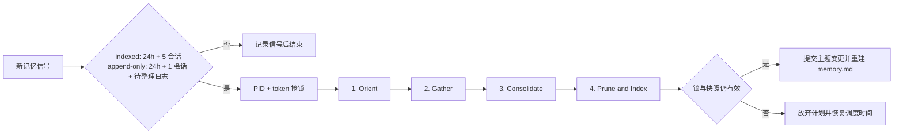

# 腰果记忆系统 06：离线整合 AutoDream v1

状态：已接入 Extract Memories 与 append-only 夜间 Dream 链路
日期：2026-08-09

## 一、定位

Extract Memories 是逐轮提取：每次 durable assistant 消息完成后判断本轮有没有新的长期信号。AutoDream 是跨会话复盘：它扫描 Memdir、近期会话日志与受约束的仓库事实源，合并重复主题、解决冲突、删除被推翻事实并重建索引。

AutoDream 不在前台 turn 内运行，也不阻塞用户回复。它复用现有 `runToolLoop()` 与 `AiRouter`，没有第二个 Agent 引擎、供应商或宿主持有的语义分类器。重复、冲突、事实取舍、合并目标和最终正文都由模型决定；宿主只执行时间、会话、锁、路径、快照、格式和大小约束。

## 二、触发链路与双门控

一次 `pin_memory` 或 Extract Memories 写入只有在确实产生非重复条目时，才提交当前会话的新记忆信号。同一任务是一个会话，稳定标识为 `projectId + taskId`；同一会话多次写入只更新同一个信号文件，不增加会话数。

每个 canonical Memdir 包含：

```text
memory/
├── memory.md
├── <type>-<topic>.md
├── logs/
│   ├── <YYYY-MM-DD>.md
│   └── processed/
├── .autodream.lock
└── .autodream-sessions/
    └── <session-sha256-32>.json
```

`indexed` 模式的触发条件必须同时成立：

```text
now - .autodream.lock.mtime >= 24 hours
AND
count(distinct session signals newer than lock.mtime) >= 5
```

第一条新信号会初始化锁文件和时间基线，因此新安装不会立即扫描既有全部数据；最早在基线后 24 小时、且累计 5 个不同会话后启动。成功整合后只清理本次消费且没有被并发更新的信号；整合运行期间产生的新信号保留到下一周期。

`append-only` 模式由应用启动补偿扫描与本地时间 02:00 的夜间入口调度；门控改为至少 24 小时、至少 1 个新记忆会话并且至少 1 个待整理日期日志。它不降低语义质量要求，只把高频索引写入集中到一次离线整理。

## 三、四阶段模型协议



### 1. Orient / 定向探索

首个工具回合只能调用 `orient`。返回 `memory.md`、全部主题的 Front Matter 元数据、大小、append-only 待整理日志入口、近期会话别名与 canonical repository 入口，不预先把所有正文塞给模型。模型比较名称、描述和类型，识别可能重复、近似、冲突或过长的主题。

### 2. Gather / 信息收集

模型读取全部待整理日期日志、最近 5 个可用会话转录，并完整读取每个拟重写、合并或删除的主题。只有旧记忆提出可由仓库验证的具体主张时，模型才读取对应仓库文件，或使用 `exact_search`：

- 搜索词是 2–120 字符的原样字符串，不接受正则表达式；
- 转录搜索必须指定单个会话别名；
- 仓库目录搜索必须指定明确目录和 `include` glob；
- 单次最多扫描 80 个普通文本文件、返回 80 条匹配；
- `.git`、`node_modules`、`dist`、`coverage` 等目录不进入扫描。

完成信息收集后，模型单独调用 `begin_consolidate`。

### 3. Consolidate / 整合

模型通过 `rewrite_memory` 提交已有主题的完整替换正文，通过 `delete_memory` 删除已合并副本。普通 indexed 整合不能创建主题；append-only 日志包含没有对应主题的新信号时，模型可用 `create_memory` 创建一个主题。宿主要求全部待整理日志已读取，模型仍必须把近似信号合并，不能制造近似副本。

核心冲突规则：

- 当前用户明确信号高于旧记忆；
- 正向和负向 feedback 都保留其有效依据；
- `project` 相对日期必须转换为 `YYYY-MM-DD`；
- 新事实推翻旧事实时，新正文中直接删除旧事实，不保存“已过时”“旧版本”或两个并存状态；
- 无法由日志、记忆或权威仓库文件解决的断言不猜测，删除无依据的具体表述。

完成后，模型单独调用 `begin_prune`。

### 4. Prune and Index / 修剪与索引

模型继续压缩冗长正文和 Front Matter 描述，删除已确认失效的外部指针、不符合四种封闭类型的信息及合并后的空壳主题。`finish_autodream` 最终校验：

- 主题文件不超过 200 个；
- 每条 description 不超过 150 字符；
- `memory.md` 不超过 200 行和 25KB；
- 主题类型与文件名前缀不变；
- 所有重写或删除目标都已在 Gather 阶段读取；
- AutoDream 运行期间 Memdir 没有发生并发变化。

append-only 提交成功后，宿主把本次消费的日期日志原样移动到 `logs/processed/`，并把新索引权限恢复为只读。索引仍由最终主题 Front Matter 确定性重建，模型不直接手写索引行。


## 四、多实例锁：mtime、PID 与复读竞争

`.autodream.lock` 是普通 `nlink=1` 文件。空闲和运行状态都保存 PID；运行状态额外保存唯一 token、启动时间和本次抢锁前的成功整合 mtime。同一进程中的两个服务实例 PID 相同，token 仍能区分所有权。

抢锁顺序：

1. 读取锁 mtime，验证双门控。
2. 写入自己的 `PID + token`。
3. 连续复读两次；任一次读回的 token 不同即判定竞争失败。
4. 把锁 mtime 恢复为抢锁前的成功整合时间，避免“开始运行”被误记为“已经成功”。
5. 每个阶段工具和最终文件提交都复查所有权。

后写入的竞争者覆盖 token 后成为当前持有者；先写实例在下一次复读或工具边界发现所有权变化并退让。读阶段即使短暂重叠也不会落盘；最终写入还要通过锁复查和 Memdir 快照摘要比较。

## 五、失败恢复与提交保护

AutoDream 开始时创建当前 Memdir 的内容摘要快照；append-only 模式的摘要同时覆盖全部待整理日志。`rewrite_memory`、`create_memory` 与 `delete_memory` 只修改内存计划；`finish_autodream` 才进入 Memdir 的串行写区。若 Extract Memories 或主 Agent 在此期间写入了新记忆，快照摘要变化，本次提交返回 `MEMDIR_RESHAPE_CONFLICT`，不覆盖新内容或吞掉新日志。

提交过程先准备新主题与新索引，再逐项检查锁并原子替换。中途错误会恢复已触碰主题和原 `memory.md`。模型失败、达到 12 轮上限、锁丢失或提交冲突时，锁内容与 mtime 恢复到抢锁前状态；下一次新记忆信号仍可重新满足门控。只有 `finish_autodream` 成功后才把锁 mtime 更新为完成时间。

## 六、实现位置

- 调度与模型循环：`src/platform/memory/autodream/autoDreamService.js`
- 双门控、信号与锁：`src/platform/memory/autodream/autoDreamState.js`
- 四阶段工具与检索边界：`src/platform/memory/autodream/autoDreamTools.js`
- 快照、重写、删除与索引提交：`src/platform/memory/memdir/memdirStore.js`
- Extract Memories 接线：`src/platform/memory/extraction/memoryExtractionService.js`
- 模型契约：`workspace/registries/prompts/blocks/memory.autodream.v1.json`
- 回归测试：`tests/memory-autodream.test.mjs`
- Agent 持久记忆与日志回归：`tests/agent-persistent-memory.test.mjs`

作用域、快照、日志格式与 Prompt 缓存边界见 [腰果记忆系统 07：Agent 持久记忆与永续日志 v1](./腰果记忆系统-07-Agent持久记忆与永续日志-v1.md)。
