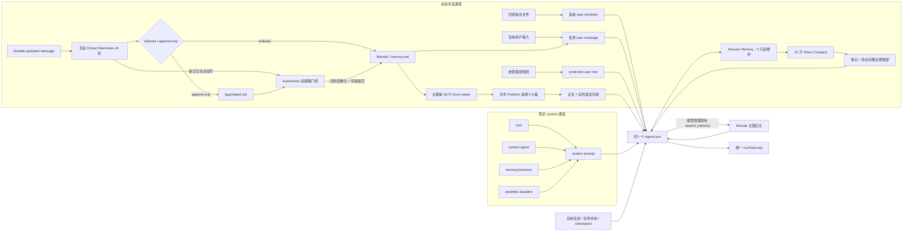

# 腰果记忆系统总览 v1

状态：第一维、第四维、第五维与第六维已落地，其余两维完成统一边界定义
日期：2026-08-09

## 一、统一架构：六个维度，三个问题

腰果的“记忆”不是一个数据库，也不是把所有历史一起塞进上下文。六个维度分别拥有不同的来源、权威、生命周期和注入位置，但都必须回答三个问题：

1. 进入：什么内容可以成为这一维记忆，谁有权写入。
2. 取用：何时进入当前上下文，按什么顺序和预算加载。
3. 演化：如何更新、冲突、遗忘，以及怎样留下可审计依据。

| 维度 | 解决的问题 | 主要载体 | 当前状态 |
|---|---|---|---|
| 1. 指令记忆 | Agent 在组织、用户、项目和局部目录中应怎样工作 | `YAOGUO.md` 文件族与 `InstructionMemoryService` | v1 已接入唯一 Agent 运行链路 |
| 2. 当前会话 | 这次对话已经说了什么 | `TaskSessionStore`、活跃消息窗口 | 已有 durable session，待统一来源摘要 |
| 3. 任务状态 | 事情做到哪里、下一步是什么 | run、todo、checkpoint、成品与工具回执 | 已有运行载体，待统一状态模型 |
| 4. 跨会话知识 | 以后仍应知道哪些代码外事实、偏好、反馈和外部指针 | Agent 隔离 Markdown Memdir、AI Prefetch、Extract Memories、`search_memory`、`pin_memory` | 三作用域、快照、动态召回与双写入模式已接入唯一 Agent 运行链路 |
| 5. 压缩后的连续性 | 原文退出活跃窗口后如何继续 | 渐进式 `session/memory.md`、协议安全近期尾部、结果引用 | v1 已接入唯一 Agent loop；10 万 Token 后直接使用持续笔记 Compact |
| 6. 离线重塑 | 长期积累如何合并、解决冲突、修剪和重组 | AutoDream 双门控、四阶段 Agent、PID/CAS 锁与快照提交 | v1 已接入 Extract Memories 后台链路 |

规则不是事实，事实不是任务状态，摘要也不能反过来改写原始规则。六维共享作用域、来源、摘要指纹、Token 预算和诊断语言，但不共享同一种权威。

## 二、双轨注入

记忆相关内容沿两条独立通道进入模型。

### 通道 A：用户规则

人工编写的 Managed、User、Project、Local 指令由 `InstructionMemoryService` 发现并渲染。初始规则作为模型请求消息数组中的第一条 `user` message 注入，完整正文由 `<system-reminder>` 包裹；它不进入 system prompt。

有规则时，初始消息顺序固定为：

```text
0  system  soul + system.agent + memory.behavior + aesthetic.baseline
1  user    <system-reminder><instruction-memory>...</instruction-memory></system-reminder>
2  user    当前目录会话的真实任务输入
```

没有有效规则时，第 1 条省略。这里的“对话消息”是当前目录任务发给模型的消息列，不恢复旧 Chat 执行栈，也不把宿主提醒伪装成 UI 中由用户手工发送的消息。

工具访问新子目录后，新增规则以另一条宿主生成的 `user` 根消息进入后续模型轮，并作为 protected root 穿过工具结果清理和 checkpoint。

### 通道 B：系统记忆行为规范

系统内建的记忆类型、保存条件、召回条件、冲突顺序与连续性边界位于：

```text
block://system.agent#memory.behavior
```

`AiRouter` 通过独立的 system prompt section 加载器把它放入 system prompt。该 section 不含任何用户或项目规则正文；内部结构化模型调用不加载通道 A，也不加载这套面向 Agent 的行为规范。

### 为什么必须分轨

| 关注点 | 通道 A：用户规则 | 通道 B：系统规范 |
|---|---|---|
| 更新频率 | 文件可频繁变化 | 随产品版本稳定变化 |
| 消息角色 | 第一条或受保护的后续 `user` message | `system` section |
| 缓存 | 任务会话级 `memoryFiles` + `userContext` | 任务会话级 `systemPromptSections` |
| Token 预算 | 初始、累计、单文档分别限制 | 属于稳定 system prompt 预算 |
| 失效关系 | 文件变化只重算指令快照 | 不因 `.md` 变化而失效 |

因此用户调整 `.md` 不会热重载，也不会使稳定的记忆行为规范重新组装。`/memory` 只清文件解析层；`/clear` 与 Compact 清三层，规则切换只发生在明确边界。

## 三、权威与冲突顺序

从高到低：

```text
内置 system / 宿主权限
  > 当前用户明确要求
  > Local
  > Project（离目标路径近 > 远）
  > User
  > Managed
  > 可检索知识、压缩摘要和外部资料
```

Managed 是可覆盖的组织默认值，不是不可覆盖的合规策略。真正不可覆盖的约束必须存在于 system、权限服务、沙箱或工具 schema 中。

## 四、六维的共同不变量

1. 主 Agent、Extract Memories 与 AutoDream 复用同一个 `runToolLoop()`；Prefetch 是无工具的单一职责模型调用。系统不创建第二引擎或内容分发器。
2. 当前用户要求高于历史偏好；任何记忆都不能扩大宿主授权或文件作用域。
3. 每次注入都能说明类型、来源、作用域、顺序、Token 数与摘要指纹。
4. 活跃上下文采用“必要常驻 + 相关召回 + 可回读引用”，不一次性装入所有历史。
5. 当前会话与任务状态由宿主持久化，不通过 `pin_memory` 复制成长期知识。
6. 压缩连续性是派生表示；需要精确内容时回读来源，摘要中的新措辞不自动升级为事实。
7. indexed Memdir 在“24 小时 + 5 个不同会话”后离线重塑；append-only Memdir 在“24 小时 + 1 个新记忆会话 + 待整理日志”后由夜间 Dream 入口重塑。两者都提交可审计变更计划，不能在前台 turn 改写人工规则。
8. trace 不保存规则正文或绝对路径，只保存 digest、Token、来源数量/摘要和诊断代码。

## 五、上下文构造



详细实现契约见 [腰果记忆系统 01：指令记忆 v1](./腰果记忆系统-01-指令记忆-v1.md)、[腰果记忆系统 04：长期记忆 Memdir v1](./腰果记忆系统-04-长期记忆-Memdir-v1.md)、[腰果记忆系统 04A：动态召回 Prefetch v1](./腰果记忆系统-04A-动态召回-Prefetch-v1.md)、[腰果记忆系统 04B：自动写入 Extract Memories v1](./腰果记忆系统-04B-自动写入-Extract-Memories-v1.md)、[腰果记忆系统 05：摘要记忆 Session Memory v1](./腰果记忆系统-05-摘要记忆-Session-Memory-v1.md)、[腰果记忆系统 06：离线整合 AutoDream v1](./腰果记忆系统-06-离线整合-AutoDream-v1.md)、[腰果记忆系统 07：Agent 持久记忆与永续日志 v1](./腰果记忆系统-07-Agent持久记忆与永续日志-v1.md) 与 [腰果记忆系统 08：三层缓存与确定性 v1](./腰果记忆系统-08-三层缓存与确定性-v1.md)。

## 六、当前边界

旧 `workspace/memory/` 与项目 `memory/` Markdown 体系已退役；运行时不再创建、扫描或迁移这些目录。工作区的遗留副本只能在明确的不可逆授权后离线删除。`AGENTS.md`、`CLAUDE.md` 不会被自动解释为腰果规则。Extract Memories 只提炼新增对话；AutoDream 只维护 Memdir，不会从旧目录导入数据或改写人工规则。

下一阶段是把任务状态来源统一到同一可见性模型，并提供 User 规则、Agent profile 与 Memdir 快照的设置页入口；这些工作不改变已经落地的双轨边界。
